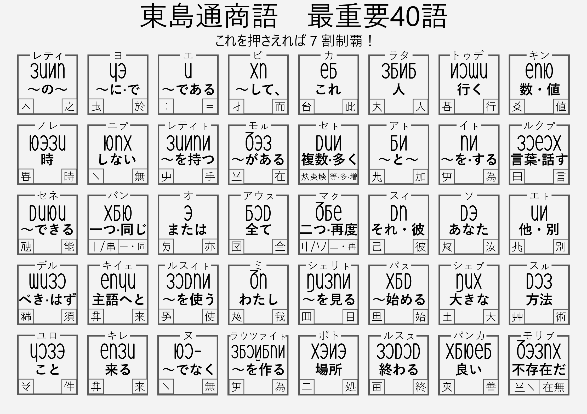
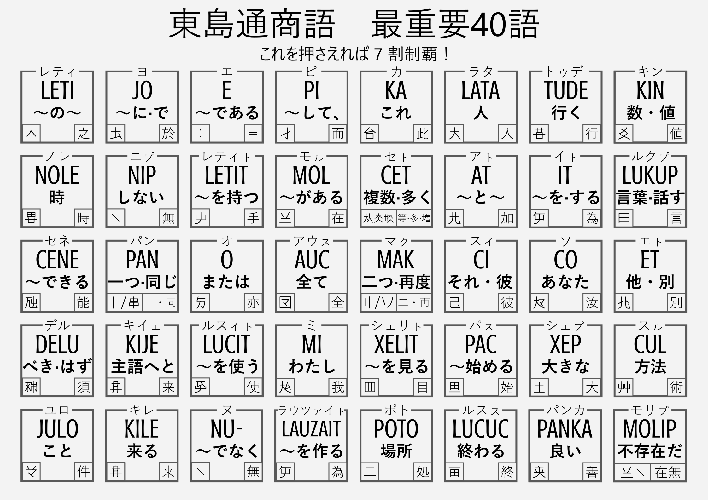

# pmcp_50on

pemecepe lujot・pemecepe lukup を日本語話者に効率的に教えるための諸資料

## 50 音表（完成）

pemecepe lujot を日本語話者に効率的に教えるための 50 音表

## 最重要 40 語（完成）

東島通商語　最重要 40 語（これを押さえれば 7 割制覇！）

### ペメセペ・ルヨット版

#### 日本語版

### ラテン文字版

## 50 音順辞書（別リポジトリに移管）

### 大まかなデザイン

[大まかなデザイン](./dictionary_planning/dictionary-component-font-spec.md)

### 実装

Vivliostyle で CSS 組版をする。2025年5月7日に https://github.com/sozysozbot/linzklar_and_pmcp_paper_dictionary に移管
