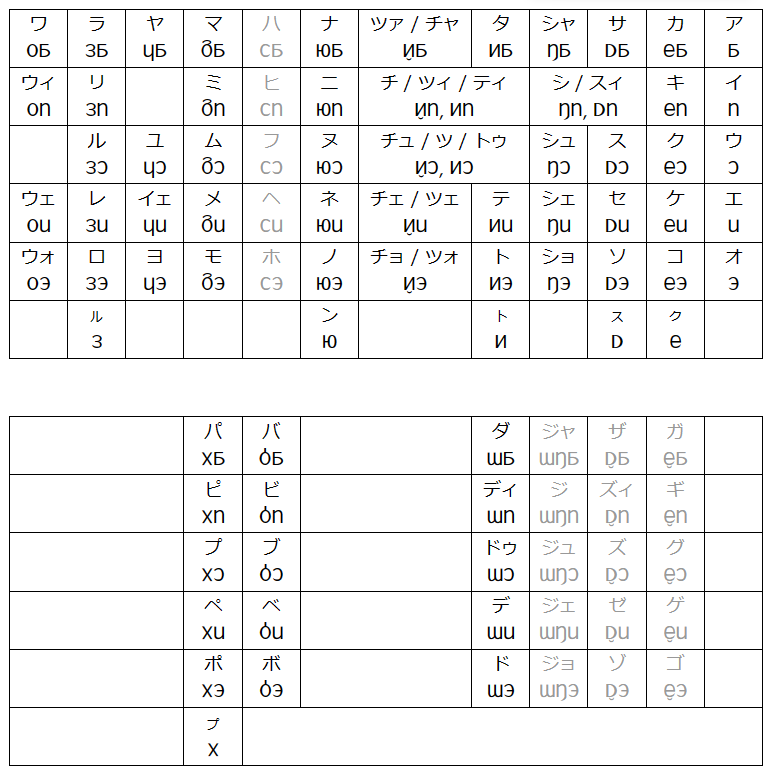

# pmcp_50on

pemecepe lujot・pemecepe lukup を日本語話者に効率的に教えるための諸資料

## 50 音表（完成）

pemecepe lujot を日本語話者に効率的に教えるための 50 音表

## 最重要 40 語（完成）

東島通商語　最重要 40 語（これを押さえれば 7 割制覇！）

## 50 音順辞書（未完成）

[大まかなデザイン](./dictionary/dictionary-component-font-spec.md)
