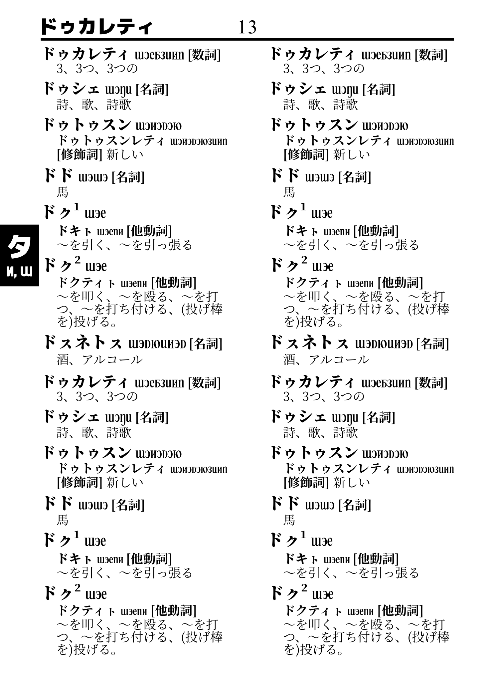
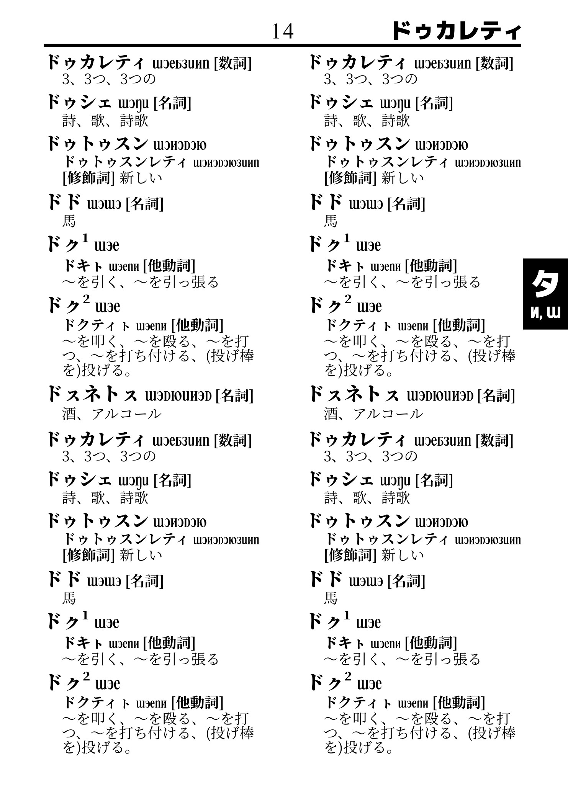
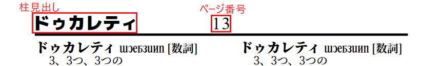

## 仮組み by S_Y15

| 左ページ | 右ページ |
|--------|---------|
|  |  |

## 辞書を構成するコンポーネントとそのフォント

| コンポーネント                                | 字種         | フォント               | weight | size       | stroke-width |
| ----------------------------------- | ------------ | ---------------------- | ------ | ---------- | ------------ |
| 柱見出し (guide word)               | カタカナ     | M+ 1p Heavy            | 900    | 4.93889px  | 0.723        |
| ページ番号 (page number)            | アラビア数字 | Times New Roman        | normal | 4.93889px  | 0.723        |
| 爪見出し (thumb index)              | カタカナ     | M+ 1p Heavy            | 900    | 6.98031px  | 1.19215      |
| 爪見出し (thumb index)              | pmcp lujot   | xedixel                | normal | 4.23333px  | 0.723        |
| 親見出し (entry word)               | カタカナ     | Source Han Serif Heavy | 900    | 4.233333px | 0.723        |
| 親見出し (entry word)               | pmcp lujot   | acil_lujot             | normal | 4.233333px | 0.723        |
| 親見出しの品詞欄 (entry word's POS) | 漢字         | Source Han Serif Bold  | bold   | 3.175px    | 0.723        |
| 子見出し (sub-entry)                | カタカナ     | Source Han Serif Heavy | 900    | 3.175px    | 0.723        |
| 子見出し (sub-entry)                | pmcp lujot   | acil_lujot             | normal | 3.175px    | 0.723        |
| 子見出しの品詞欄 (sub-entry's POS)  | 漢字         | Source Han Serif Bold  | bold   | 3.175px    | 0.723        |
| 語釈 (definition)                   | 漢字と仮名   | Source Han Serif       | normal | 3.175px    | 0.723        |
